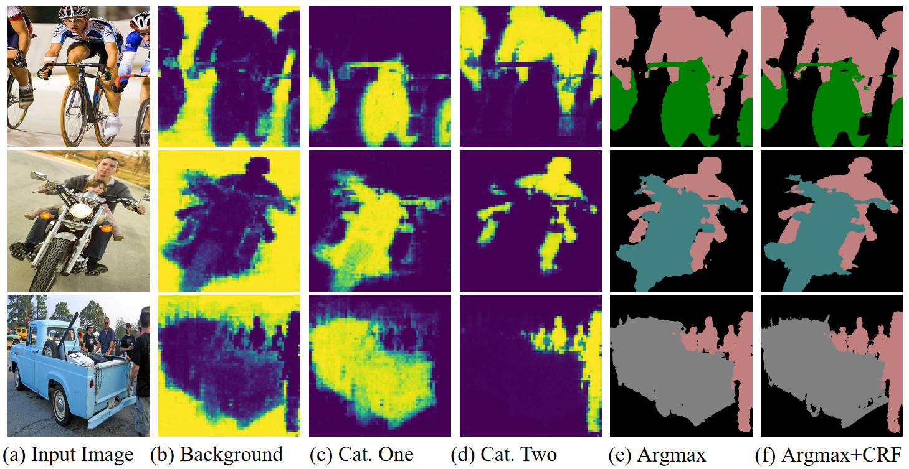

# Max Pooling with Vision Transformers reconciles class and shape in weakly supervised semantic segmentation 



Official implementation of:

*Max Pooling with Vision Transformers reconciles class and shape in weakly supervised semantic segmentation, Simone Rossetti, Damiano Zappia, Marta Sanzari, Marco Schaerf and Fiora Pirri, ECCV 2022* <!-- [[Paper]]() -->
## Citation
**IMPORTANT**: paper will be made publicly available soon by ECCV 2022 proceedings of Springer.

If you find the code useful, please consider citing our paper using the following BibTeX entry.
```
@InProceedings{10.1007/978-3-031-20056-4_26,
    author="Rossetti, Simone and Zappia, Damiano and Sanzari, Marta and Schaerf, Marco and Pirri, Fiora",
    editor="Avidan, Shai and Brostow, Gabriel and Ciss{\'e}, Moustapha and Farinella, Giovanni Maria and Hassner, Tal",
    title="Max Pooling with Vision Transformers Reconciles Class and Shape in Weakly Supervised Semantic Segmentation",
    booktitle="Computer Vision -- ECCV 2022",
    year="2022",
    publisher="Springer Nature Switzerland",
    address="Cham",
    pages="446--463",
    abstract="Weakly Supervised Semantic Segmentation (WSSS) research has explored many directions to improve the typical pipeline CNN plus class activation maps (CAM) plus refinements, given the image-class label as the only supervision. Though the gap with the fully supervised methods is reduced, further abating the spread seems unlikely within this framework. On the other hand, WSSS methods based on Vision Transformers (ViT) have not yet explored valid alternatives to CAM. ViT features have been shown to retain a scene layout, and object boundaries in self-supervised learning. To confirm these findings, we prove that the advantages of transformers in self-supervised methods are further strengthened by Global Max Pooling (GMP), which can leverage patch features to negotiate pixel-label probability with class probability. This work proposes a new WSSS method dubbed ViT-PCM (ViT Patch-Class Mapping), not based on CAM. The end-to-end presented network learns with a single optimization process, refined shape and proper localization for segmentation masks. Our model outperforms the state-of-the-art on baseline pseudo-masks (BPM), where we achieve 69.3{\%} mIoU on PascalVOC 2012 val set. We show that our approach has the least set of parameters, though obtaining higher accuracy than all other approaches. In a sentence, quantitative and qualitative results of our method reveal that ViT-PCM is an excellent alternative to CNN-CAM based architectures.",
    isbn="978-3-031-20056-4"
}
```

## Setup
Tested on Ubuntu 20.04, with Python 3.8.10, Tensorflow 2.9.1, CUDA 11.2, and 4x NVIDIA TITAN V (Volta).
### 1. Prepare nvidia-docker container
Follow step 1 in [container instructions](container/README.md#1-install-docker).

### 2. Open project in nvidia-docker container
Run tensorflow container:
```bash
# clone the repo and move into the project
cd $HOME/ViT-PCM

# build and run the container; optional flags:
#     -n [container name] specify a custom container name;
#     -b rebuild the image whether already exists.
bash container/main.sh 
```


### 3. Download, build and convert in tfrecords: PascalVOC 2012 and/or MS-COCO 2014
Follow [datasets instructions](datasets/README.md).

## Usage
Before running your experiments edit the *.yaml* config file in */configs* directory:
```bash
# move in the working directory
cd /workdir

# run distributed training:
#     -c [model_config_yaml] specify the configuration to run;
#     --cuda whether to distribute process over visible GPUs, default is CPU.
python main.py train -c model_config_yaml --cuda 

# run distributed evaluation:
#     -c [model_config_yaml] specify the configuration to run;
#     -m [model_path_h5] specify model path to load;
#     --cuda whether to distribute process over visible GPUs, default is CPU.
python main.py eval -c model_config_yaml -m model_path_h5 --cuda 

# run test:
#     -c [model_config_yaml] specify the configuration to run;
#     -m [model_path_h5] specify model path to load;
#     --cuda whether to use single visible GPU, default is CPU;
#     --crf whether to run crf post-processing.
python main.py test -c model_config_yaml -m model_path_h5 --cuda --crf
```

## Results and Trained Models

| Model         | Dataset  | Train (mIoU)    | Val (mIoU)    | |
| ------------- |:-------------:|:-------------:|:-----:|:-----:|
| ViT-PCM/S     | VOC2012 | 67.11 | 64.94 | ECCV 2022 submission |
| ViT-PCM/B     | VOC2012 | 71.39 | 69.32 | ECCV 2022 submission |
| ViT-PCM/S     | VOC2012 | 67.57 | 66.08 | [[Weights]](https://drive.google.com/file/d/1RxfQyoU0s0LKrU7RAk-AZYp2DsvTztcu/view?usp=sharing) |
| ViT-PCM/B     | VOC2012 | 71.79 | 69.23 | [[Weights]](https://drive.google.com/file/d/1tFOkeJcl1v4Hkf4fE7jVpS3DtDP7rdtc/view?usp=sharing) |
| ViT-PCM/B     | COCO2014 | - | 45.03 | [[Weights]](https://drive.google.com/file/d/1-ItfAJKtEJympPBAYVaYkIDp7cm-Y-VV/view?usp=sharing) |


## Open project in VSCode (optional)
First make sure [Setup](#setup) is completed, then:
1. Install latest [VSCode](https://code.visualstudio.com/download),
2. Open the project in VSCode locally or from remote using SSH (install in VSCode from *Extensions > Remote-SSH* or from [link](https://marketplace.visualstudio.com/items?itemName=ms-vscode-remote.remote-ssh)),
3. Install in VSCode from *Extensions > Remote-Containers* or from [link](https://marketplace.visualstudio.com/items?itemName=ms-vscode-remote.remote-containers),
4. Open *Command Palette* with <kbd>F1</kbd> or <kbd>Ctrl+P</kbd>, type and run *Remote-Containers: Open Folder in Container..*.
